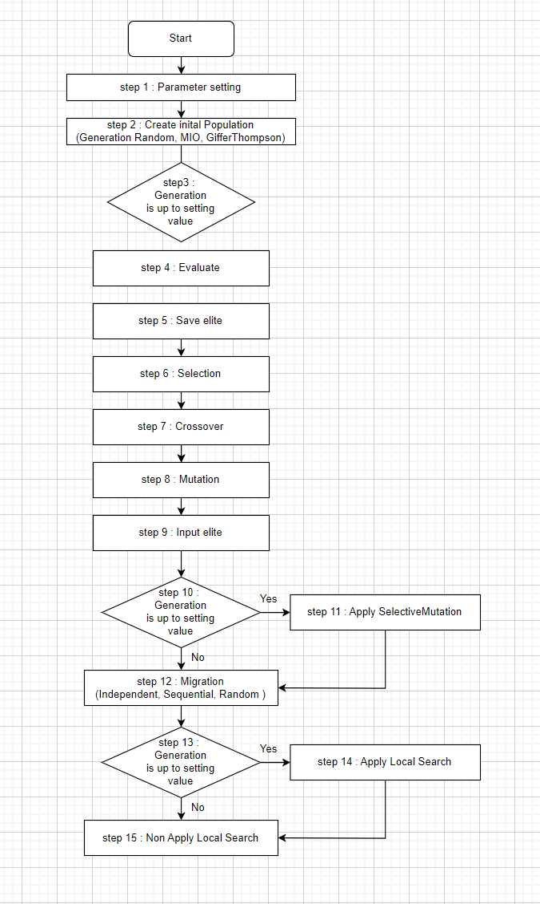

# 📊 Hybrid Genetic Algorithm with MIO for Solving JSSP

|                   Developer               |                Developer               |                
| :--------------------------------------: | :-----------------------------------: | 
| [Jiwon Baek](https://github.com/Jiwon-Baek) | [Hyunjin Oh](https://github.com/hyunjinei) |
|                   🧑‍💻 AI-Development |                 🧑‍💻 AI-Development                  |                


## 👀 Project Overview

-  📆 Project Duration
   -  2024.05.11 ~ 2024.06.12 (5 weeks)


## 💁‍♂️ Project Introduction

**Hybrid Genetic Algorithm with MIO** is an optimization algorithm designed to solve the Job Shop Scheduling Problem (JSSP). 
<br>
For more information about MIO, please check [this link](https://github.com/SNUPEL/2024_JSSP_MIO).

This project tracks job sequences and machine states, using MIO to consider the interactions between jobs and machines for generating initial solutions. It employs various crossover, mutation, and selection methods to find optimal solutions and combines them with local search to achieve better results.


## 💡 Main Functions

### 1️⃣ Overall Process



<br>

### 2️⃣ GA Development

#### Population Initialization

- Types of Population Initialization
    - **basic**
        - Creates individuals randomly
    - **MIO**
        - Tracks job sequences and machine states, considering the interactions between jobs and machines to generate initial solutions
        - Initializes after creating random individuals using MIO
    - **GifflerThompson**
        - Creates random individuals and initializes each individual using one of Giffler-Thompson priority rules ('SPT', 'LPT', 'MWR', 'LWR', 'MOR', 'LOR', 'EDD') randomly


#### Crossover
- Types of Crossover
    - **OrderCrossover (OX)**
        - Focuses on maintaining the order of genes
    - **PMXCrossover (PMX)**
        - Resolves conflicts based on the mapping of crossover segments and exchanges substrings between two parents
    - **LOXCrossover (LOX)**
        - Performs linear crossover between genes of two parents
    - **OrderBasedCrossover (OBC)**
        - Creates offspring by applying the gene order of one parent to another without order conflicts
    - **PositionBasedCrossover**
        - Randomly selects gene positions and exchanges genes between two parents to create offspring
    - **CycleCrossover (CX)**
        - Uses cyclical structure between parents to exchange genes at cyclical positions
    - **SubstringExchangeCrossover (SXX)**
        - A type of two-cut-points crossover for general literal string encodings
    - **PartialScheduleExchangeCrossover (PSX)**
        - Considers partial schedules as blocks for exchange

#### Mutation
- Types of Mutation
    - **DisplacementMutation**
        - Selects a random substring and inserts it at a random position
    - **InsertionMutation**
        - Selects a random gene and inserts it at a random position
    - **ReciprocalExchangeMutation**
        - Selects two random positions and exchanges the genes at these positions
    - **ShiftMutation**
        - Selects a random gene and moves it to a random position
    - **InversionMutation**
        - Selects two random positions within the chromosome and inverts the substring between these positions
    - **SwapMutation**
        - Selects two random positions and exchanges the genes at these positions
    - **GeneralMutation**
        - Selects a gene and exchanges it with another randomly chosen gene

#### Selection
- Types of Selection
    - **TournamentSelection**
        - Selects the best individual from a randomly chosen subset of individuals through a tournament
    - **SeedSelection**
        - Selects one parent as the best individual and the other parent randomly
    - **RouletteSelection**
        - Selects individuals proportionally to their fitness, giving higher probability to individuals with better fitness


#### Selective Mutation
- Divides individuals into two groups based on fitness (upper/lower)
- Applies different mutation probabilities to each group to avoid local optima
    - **pm_high**
        - High mutation probability (applied to lower-ranking individuals)
    - **pm_low**
        - Low mutation probability (applied to higher-ranking individuals)
    - **rank_divide**
        - Criterion for dividing the population into two groups based on performance

#### Fitness
- Used in Selection
- Uses target makespan for fitness function
    - $Fitness = \frac{1}{\frac{Makespan}{Targetmakespan}}$
- Implements scaling methods in the population
    - **min-max**
    - **rank**
    - **sigma**
    - **boltzmann**

#### Target Makespan
- The GA terminates when the target makespan is reached

<br>

### 3️⃣ Elitism
- Ensures elite individuals
    - Replaces the worst individual
    - Random replacement

<br>

### 4️⃣ Hybrid
#### Local Search
- Local search events occur at specific intervals
- Carried out sequentially from a list, can be None
    - **HillClimbing**
        - Searches for a better solution by moving to neighboring solutions from the current solution
    - **TabuSearch**
        - Prevents local optima by prohibiting previously visited solutions during the search
    - **SimulatedAnnealing**
        - Starts with an initial temperature and gradually lowers the temperature while searching for a solution
    - **GifflerThompson**
        - Compares makespan and fitness using Giffler-Thompson priority rules

#### PSO (Particle Swarm Optimization)
- Executes PSO after all generations are completed
    - Moves particles, which are candidate solutions, within the search space for optimization

<br>

### 5️⃣ Island Migration
- Each population evolves independently
- Migration events occur at specific intervals, exchanging solutions among islands
    - **Independent**
        - Each population continues to evolve independently
    - **Sequential Migration**
        - Top 10% of island A exchanges with the bottom 90% of island B
    - **Random Migration**
        - Top 10% of island A exchanges with the bottom 90% of a random island


## 🧪 Performance Testing

### Performance Testing on Benchmark Problems
- la dataset & Ta dataset & abz5 dataset
    - Representative benchmark datasets for JSSP
    - Comparison algorithms
        - **DDQN**
            - Uses two Q-networks
        - **ACRL35**
            - Actor-critic deep reinforcement learning
        - **ML-CNN**
            - Multilevel CNN and Iterative Local Search
        - **ILS**
            - Only Iterative Local Search

### Performance Comparison Results

| Problem     | Optimal | DDQN | ML-CNN | ILS  | Non-Local | Proposed |
|-------------|---------|------|--------|------|-----------|----------|
| La01 (10x5) | 666     | 666  | 666    | 666  | 666       | 666      |
| La02 (10x5) | 655     | 655  | 655    | 667  | 688       | 655      |
| La03 (10x5) | 597     | 597  | 603    | 617  | 620       | 597      |
| La04 (10x5) | 590     | 609  | 590    | 590  | -         | 590      |
| La05 (10x5) | 593     | 593  | 593    | 593  | -         | 593      |
| La06 (15x5) | 926     | 926  | 926    | 926  | -         | 926      |
| La07 (15x5) | 890     | 890  | 890    | 890  | -         | 890      |
| Score       | -       | 6    | 6      | 5    | -         | 7        |
| TA21 (20x20)| 1642    | -    | -      | -    | 1952      | In progress |
| TA22 (20x20)| 1561    | -    | -      | -    | 1958      | Planned    |
| TA31 (30x15)| 1764    | -    | -      | -    | 2112      | Planned    |
| Abz5 (10x10)| 1234    | -    | -      | -    | 1338      | 1276     |


<br>

## 📂 File Descriptions
```bash
📂 2024_JSSP_GA
├── 📄 Readme.md
├── 📂 Config
├── 📂 Data
├── 📂 docs
├── 📂 environment
├── 📂 GAS
│   ├── 📄 run.py
│   ├── 📂 Crossover
│   ├── 📂 Local_Search
│   ├── 📂 Meta
│   ├── 📂 Mutation
│   ├── 📂 Selection
├── 📂 MachineInputOrder
├── 📂 postprocessing
├── 📂 result
│   ├── 📂 ga_generations
│   ├── 📂 result_Gantt
│   ├── 📂 result_txt
├── 📂 visualization
```
### GAS Folder
1. **run.py**: Execution file
2. **GA.py**: File related to GAEngine class
3. **Individual.py**: File related to Individual class
4. **Population.py**: File related to Population class
5. **Crossover folder**: Contains files related to crossover methods.
6. **Local_Search folder**: Contains files related to local search algorithms.
7. **Meta folder**: Contains meta-heuristic related files.
8. **Mutation folder**: Contains files related to mutation methods.
9. **Selection folder**: Contains files related to selection methods.

### environment Folder
1. **Files in environment folder**: simpy environment settings

### Config Folder
1. **RunConfig.py in Config folder**: File for Run_Config class

### postprocessing Folder
1. **Files in postprocessing folder**: File for generate_machine_log function

### visualization Folder
1. **GUI.py**: GUI file
2. **Gantt.py**: Gantt file

### result Folder
- **ga_generations folder**: Stores generation data from GA runs
- **result_Gantt folder**: Generates Gantt chart png files after completion
- **result_txt folder**: Generates machine and overall csv files after running run.py

### Data Folder
- Files in this folder can be used

### docs Folder
- Contains documentation and related images

### MachineInputOrder Folder
- Contains files related to Distance and Correlation Functions

<br>

## 🏃 How to Run
1. Move to the GAS folder
2. Adjust hyperparameters in Run.py
    - **TARGET_MAKESPAN**: Target Makespan
    - **MIGRATION_FREQUENCY**: Migration frequency
    - **random_seed**: Random seed
    - Modify **file = 'filename.txt'** in the main function
    - Adjust this function
        - **Run_Config(n_job=, n_machine=, n_op=, population_size=, generations=)**
        - Adjust the number of jobs, machines, and operations in the data, as well as the desired population size and number of generations
    - Create the desired number of GA in **custom_settings** (crossover, mutation, selection, local_search, PSO, selective_mutation and probabilities)
    - **local_search_frequency**: Local search frequency
    - **selective_mutation_frequency**: Selective mutation frequency
3. Execute with `python run.py` after adjusting parameters
4. Choose population initialization method: Random, MIO, heuristic
5. Choose migration method (Independent, Sequential, Random)

